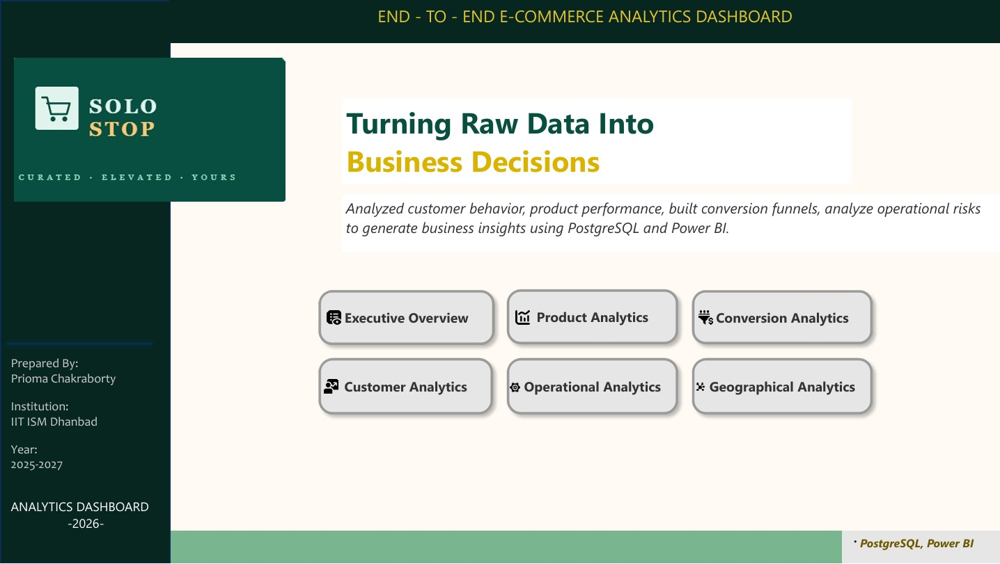
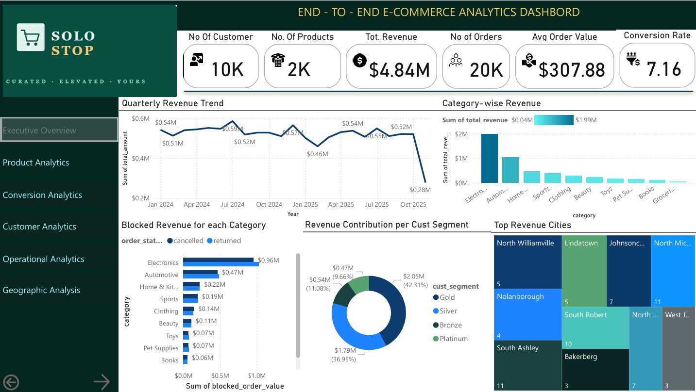
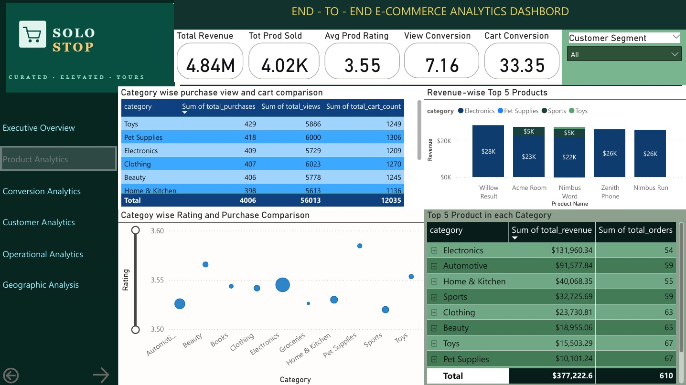
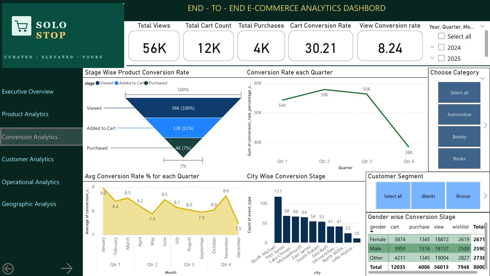
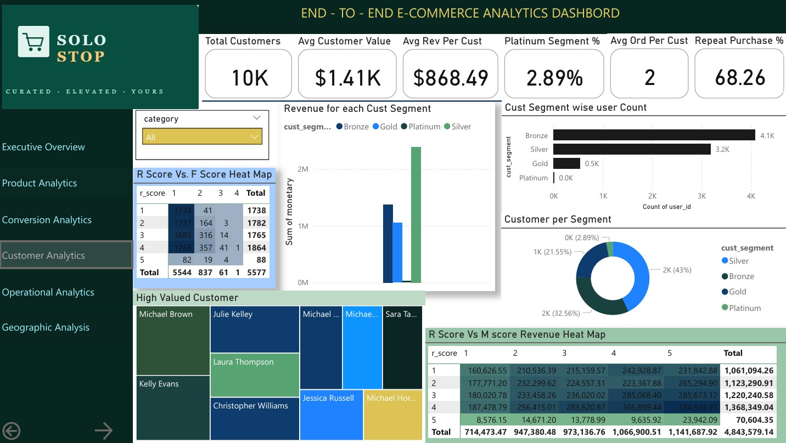
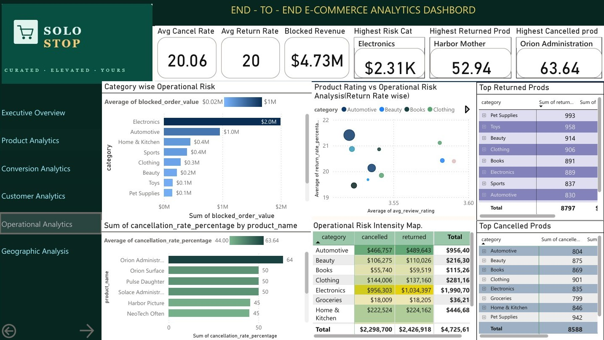

# E-COMMERCE ANALYTICS DASHBOARD

Analyzed customer behavior, product performance, built conversion funnels, analyzed operational risks to generate business insights using PostgreSQL and Power BI.

---

## 1. Project Title

**End-to-End E-COMMERCE ANALYTICS DASHBOARD | Power BI | PostgreSQL | DBeaver**

---

## 2. Purpose

This project discusses a comprehensive E-Commerce Analytics Dashboard using PostgreSQL for data analysis and Power BI for visualization to analyze customer behavior, product performance, conversion efficiency, operational risks, and geographical sales trends. The dashboard is designed to make data-driven business decisions by transforming raw data into business insights across different areas.

### • Product Analytics

Analyze category-wise and product-wise business performance by calculating revenue values, demand patterns, number of orders, to finally get product rankings within categories along with category ranking. The dashboard highlights top-performing products, high-value categories, and customer demand concentration to identify growth opportunities and trends.

### • Conversion Analytics

Track the ecommerce conversion funnel across different product categories by analyzing customer behavior from product views to cart additions to final purchases. The dashboard measures category-wise, gender-wise conversion rates to identify customer drop-off points to decide upon improvement areas.

### • Customer Analytics

Understanding customer purchasing behavior and customer value through RFM (Recency, Frequency, Monetary) Matrix to perform customer segmentation. The dashboard identifies Platinum, Gold, Silver, and Bronze customer groups, evaluates repeat purchase behavior, customer retention patterns, and revenue contribution by customer segments.

### • Operational Analytics

Evaluate operational inefficiencies and revenue leakages and blockages caused by product returns and order cancellations. The dashboard analyzes return rates, cancellation rates, operational risk by category and product, and the relationship between customer ratings and return behavior to identify fulfillment, product quality, product pricing and customer satisfaction issues.

### • Geographical Analytics

Analyze city-wise revenue generation, order distribution, customer concentration, and regional business performance to understand geographical demand patterns and market concentration.

---

## 3. Tech Stack

The dashboard was built using the following tools and technologies:

### • 🗄️ PostgreSQL & DBeaver

The Kaggel based Ecommerce dataset was imported and analyzed in PostgreSQL using DBeaver. Concepts including CTEs (Common Table Expressions), Window Functions, Joins, Aggregations were used to perform various analysis. Analytical SQL views were created specifically for Power BI reporting and dashboard integration.

### • 📊 Power BI Desktop

Main business intelligence and data visualization platform used to build interactive dashboards, analytical reports, KPIs.

### • 📂 Power Query

Used for data transformation, cleaning, and preparation for visualization.

### • 🧠 DAX (Data Analysis Expressions)

Used for calculated measures, dynamic KPIs, conditional formatting, customer metrics, and dashboard interactivity.

### • 📝 Data Modeling

Relationships established across transactional and analytical tables to enable cross-filtering and drill-down analysis.

### • 📈 Analytical Techniques

Implemented Customer RFM Segmentation, Customer Valuation Analysis, Product Ranking Analysis, ABC/Pareto-style product contribution analysis, Conversion Funnel Analytics, Return & Cancellation Risk Analysis, Repeat Purchase Analysis, and Geographical Revenue Analysis.

### • 📁 File Formats

.sql for SQL query development, .pbix for Power BI dashboard development, and .png/.pdf for dashboard previews and project documentation.

---

## 4. Data Source

The project utilizes a Kaggle-based ecommerce transactional dataset.

### Main Tables

### • Users

Contains customer-level information including user identifiers, customer details, and geographical information. Contains details of 10k customers around 4.75k cities.

### • Products

Stores product-level details including product brands, names, categories, and pricing information used for product performance and category-wise analysis. Total 2000 unique products distributed across 10 categories.

### • Orders

Captures order-level transactional information including order status, date, and total order amounts used for revenue tracking, and operational analytics. Total 20k number of order details recorded.

### • Order_Items

Contains item-level purchase details including products purchased, quantities, and item pricing. This table was used for product-level revenue analysis, category contribution analysis, and operational risk analysis.

### • Events

Contains customer interaction and behavioral event data including product views, cart additions, wish lists and purchase events used for conversion funnel and customer engagement analysis.

### • Reviews

Stores customer ratings and review information used to analyze customer satisfaction, product quality perception, and the relationship between reviews, returns, and cancellations.

---

## 5. Features / Highlights

### 🔴 Business Problem

Ecommerce businesses generate large volumes of customer, product, operational, and transactional data, but converting this raw data into actionable business insights is a significant challenge. Companies need to understand customer purchasing behavior, identify high-performing and high-risk products, optimize conversion funnels, reduce operational losses caused by returns and cancellations, and track regional demand patterns. Without structured analytics, decision-making across products, operations, marketing, and customer strategy becomes inefficient and reactive.

### Goal / Objective of the Dashboard

The goal of this project is to develop an end-to-end SQL-driven Ecommerce Analytics Dashboard using PostgreSQL and Power BI to transform raw ecommerce data into interactive business intelligence insights. The dashboard aims to support data-driven decision making through Customer Analytics, Product Analytics, Conversion Funnel Analysis, Operational Risk Analysis, and Geographical Analytics by identifying customer segments, analyzing product performance, tracking conversion behavior, evaluating operational inefficiencies, and understanding geographical business trends.

### 👁️ Brief Walkthrough of Key Visuals

### Page 1 — Executive Overview

Provides a high-level summary of overall ecommerce performance across revenue, customers, products, operations, and geographical markets. The dashboard highlights quarterly revenue trends, category-wise revenue contribution, operational revenue blockage due to returns/cancellations, RFM-based customer segment contribution, and top-performing cities. Electronics emerged as the leading revenue-generating category while also contributing the highest operational risk exposure.

---

### Page 2 — Product Analytics

Evaluates category-level and product-level business performance using Funnel Conversion Tracking, customer engagement analysis, and product satisfaction metrics. The analysis identifies high-performing products, category-wise customer interaction trends, revenue-driving SKUs, and the relationship between ratings, purchases, and monetization. Electronics and Automotive dominate revenue contribution despite comparatively lower engagement activity.

---

### Page 3 — Conversion Analytics

Analyzes customer progression through the ecommerce funnel from product views to cart additions and final purchases. The dashboard highlights major funnel drop-offs, quarterly and monthly conversion trends, city-wise conversion behavior, and demographic engagement analysis. Despite strong customer traffic and cart activity, final purchase conversion remains relatively low, indicating optimization opportunities within the purchase journey.

---

### Page 4 — Customer Analytics

Uses RFM Segmentation and customer valuation analysis to evaluate customer behavior, retention patterns, repeat purchase trends, and revenue concentration. The analysis reveals that while Bronze and Silver customers dominate the customer base, a relatively smaller group of high-value customers contributes disproportionately larger revenue.

---

### Page 5 — Operational Analytics

Focuses on operational inefficiencies caused by cancellations and returns through category-level and product-level operational risk analysis. Electronics and Automotive categories generate the highest blocked revenue exposure, while several products exhibit extremely high cancellation and return rates, highlighting fulfillment and customer expectation challenges.

---

### Page 6 — Geographical Analytics

Provides city-level analysis of revenue contribution, order distribution, and regional customer activity across ~4.75K cities. The dashboard identifies top-performing geographical markets, compares order concentration with revenue contribution, and highlights differences between high-volume and high-value regions.

---

## 6. Overall Business Impact & Insights

The analysis reveals that while the ecommerce platform demonstrates strong customer acquisition, diversified geographical reach, and healthy mid-tier customer monetization, significant inefficiencies exist within the conversion funnel and operational workflow. Electronics and Automotive categories dominate revenue generation but also contribute the highest operational risk through cancellations and returns. Funnel analysis highlights substantial customer drop-offs between product views and final purchases, indicating opportunities for pricing, checkout, and retention optimization. RFM Segmentation further shows that a small percentage of high-value customers drive disproportionately large revenue contributions, emphasizing the importance of customer retention and loyalty-focused strategies. Overall, the dashboard enables data-driven identification of revenue drivers, operational bottlenecks, customer behavior patterns, and market opportunities across the ecommerce ecosystem.

---

## 7. Dashboard Preview

![Geographical Analytics](Dashboard Screenshots/Geographic Analytics.jpg
